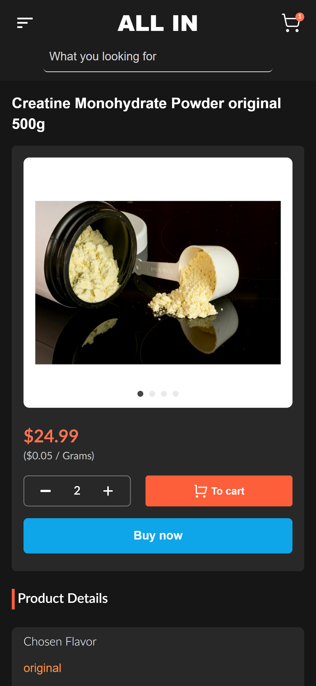

# **AllInSupplements**

**AllInSupplements** is an e-commerce platform designed for purchasing supplements online. It features a smooth shopping experience with categories for products, a shopping cart, and a secure checkout process. This project is built using modern technologies like React.js, Tailwind CSS, and TypeScript.

## **Table of Contents**

- [Technologies](#technologies)
- [Features](#features)
- [Screenshots](#screenshots)
- [Installation](#installation)
- [Usage](#usage)
- [Environment Variables](#environment-variables)
- [Testing](#testing)

## **Technologies**

The project uses the following technologies:

- **Frontend**: React (with Vite), Tailwind CSS, TypeScript
- **Backend**: Node.js, MongoDB, Express.js
- **Firebase** for image handling
- **Stripe** for payment processing
- **Axios** for API requests

## **Features**

- User authentication: Sign up, login, and user sessions.
- Product management: Admins can add, edit, and delete products.
- Cart management: Users can add, remove, and update cart items.
- Payment gateway integration: Secure checkout using Stripe.
- Responsive UI: Tailored for both mobile and desktop.
- Real-time order tracking: View and track order status.

## **Screenshots**

Mobile
<div style="display:flex;flex-wrap: wrap;gap:2px">
  
  
  
</div>


Desktop

  
  
  
  

## **Installation**

### Prerequisites:

Make sure you have the following tools installed on your local machine:

- **Node.js** (>= 16.0.0)
- **npm** or **yarn**
- **MongoDB** (local or cloud instance)

### Steps:

1. Clone this repository:
    ```bash
    git clone https://github.com/yemishi/allinsup.git
    ```

2. Navigate into the project folder:
    ```bash
    cd allinsup
    ```

3. Install dependencies for both the frontend and backend:
    ```bash
    # Backend
    cd backend
    npm install

    # Frontend
    cd ../frontend
    npm install
    ```

4. Set up environment variables for both frontend and backend (see below).

5. Run the development server:

    For the backend:
    ```bash
    cd backend
    npm run dev
    ```

    For the frontend:
    ```bash
    cd frontend
    npm run dev
    ```

Your app should now be running at `http://localhost:3000`.

## **Usage**

- **Frontend**: The user interface is built with React and styled with Tailwind CSS. It features a home page, product pages, a cart page, and a checkout flow.
- **Backend**: The backend is built with Express.js and connects to MongoDB to store product, order, and user data. Firebase is used for handling image uploads.

## **Environment Variables**

Create a `.env` file in both the **frontend** and **backend** directories with the following variables:

### Backend:
- `MONGODB_CONNECT_URL`: MongoDB connection string
- `JWT_SECRET`: JWT secret for authentication
- `STRIPE_SECRET_KEY`: Stripe backend secret key
- `APP_URL`: Frontend deploy URL
- `DEFAULT_PRODUCT_PHOTO`: Default pic url for products
- `FIREBASE_DOMAIN`: Firebase storage bucket URL
- `FIREBASE_KEY`: Firebase API key
- `SECRET_KEY`: Secret key

### Frontend:
- `VITE_API_URL`: Backend API URL
- `VITE_STRIPE_KEY`: Stripe frontend secret key

## **Testing**

To run tests:

```bash
cd frontend
npm run test

